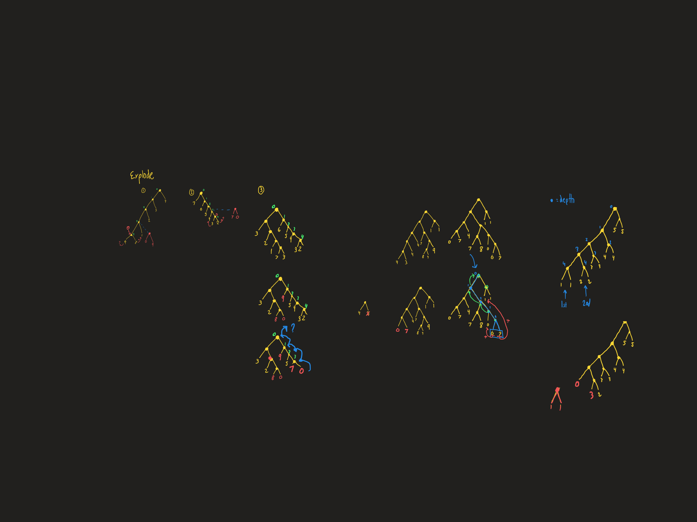

# Explanation for day 18

I'm not sure this was the best approach but I decided to convert the arrays into a binary tree. I can explode and split by traversing around the tree vs trying to recurse around an array and trying to keep track of the path of arrays I traveled. An alternative I thought was keeping the input a string and traversing and exploding that way.  We just had a scanner type problem 2 days ago so I just wanted to convert to a different data structure.. Plus I can just `eval()` the lines and get the array automatically.

I'm curious what other people did now, coming out of this I wouldn't of done it any different I just would of drawn the traversal algorithm on a sketchpad faster to understand the actual rules of the algorithm for exploding. Splitting came easy.

I ended up having trouble with the explode because the carry functions differently based on what subtree you start on and which direction you start... You also have to swap directions at most once when you hit a subtree in the area you want to carry into.

Anyways, here are my sketches/notes from trying to understand how to perform the explode logic on a binary tree:

